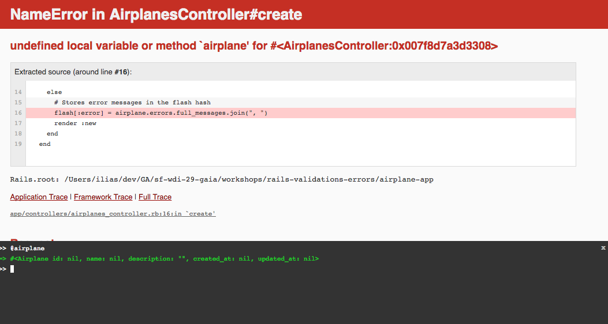

#Error-Handling & Validations

### Why is this important?
<!-- framing the "why" in big-picture/real world examples -->
*This workshop is important because:*

Error-handling is a critical part of web development. One one hand developers need to ensure their applications validate input and raise errors appropriately. On the other hand it is also important design a good user experience for when these errors occur.

### What are the objectives?
<!-- specific/measurable goal for students to achieve -->
*After this workshop, developers will be able to:*

- Use built-in ActiveRecord validation methods to validate database entries.
- Display errors in the view using Rails `flash` messages.
- Set breakpoints to check your assumptions

### Where should we be now?
<!-- call out the skills that are prerequisites -->
*Before this workshop, developers should already be able to:*

- Construct a basic Rails application

##Error Handling

**The best error-handling strategy is a combination of both [client-side](https://developer.mozilla.org/en-US/docs/Web/Guide/HTML/Forms/Data_form_validation) and server-side validations.**

Client-side validations ensure a good *user experience* by providing real-time, inline feedback on the user input. Server-side validations are **essential** for maintaining *database integrity*, especially if the client-side validations are ever compromised or purposely circumvented.

Today we'll be focusing on server-side validations in Rails, using [Active Record Validations](http://guides.rubyonrails.org/active_record_validations.html).

##Airplane App

For the purposes of this workshop there is a Rails app, `airplane-app` inside the repo that demonstrates the below examples.

The application was generated with: `rails new airplane-app -T -B -d postgresql` in order to prevent Rails from automatically creating tests (`-T`), prevent it from automatically bundling (`-B`), and set the database postgres (`-d postgresql`).

>Be sure to `bundle`, `rake db:create db:migrate db:seed`, and have postgres running before launching the application.

## Model Validations

Validations provide security against invalid or harmful data entering into the database. ActiveRecord provides a [convenient and easy set of built-in methods](http://guides.rubyonrails.org/active_record_validations.html) for validating model attributes, as well as the ability to define custom validator methods. An example of a built-in validation:

**app/models/airplane.rb**

```ruby
class Airplane < ActiveRecord::Base
  validates :name, presence: true, uniqueness: true, length: {minimum: 6}
end
```

>Here, the model is told to validate itself before saving to the database. The `validates` method takes the model as it's first argument and configuration options as the remaining arguments.

In `rails console`, if you try adding a new airplane to the database where a name is

* not present
* a duplicate
* fewer than 6 characters

you'll get an error causing a `ROLLBACK`. Try, `Airplane.create(name: "747")`, which is a name of only three characters and see what happens.

What if you call `Airplane.create!(name: "747")`?

Alternatively, we can check any piece of data we are about to save with the `.valid?` method. So, instead if immediately calling`.create`. In that case, we can create a `.new` airplane instance in memory (without saving it to the database), then asking if it's `.valid?` before calling `.save`.

```bash
> airplane = Airplane.new(name: "747")
=> #<Airplane id: nil, name: "747", description: nil, created_at: nil, updated_at: nil>
> airplane.valid?
=> false
```

The [`.valid?`](http://guides.rubyonrails.org/active_record_validations.html#valid-questionmark-and-invalid-questionmark) method returns `true` if the new record passes the model validations and `false` if it fails any validations.

Moreover, we can call [`.errors.full_messages`](http://guides.rubyonrails.org/active_record_validations.html#errors-add) to returns an array of user-friendly error messages, which is very useful and will be helpful for our user experience later.

```bash
> airplane.errors.full_messages
=> ["Name is too short (minimum is 6 characters)"]
```

Let's look at how we can display the error messages to the user so they know what went wrong if their input doesn't pass our validations.

###Challenge: Duplicates

Get the `airplane.errors.full_messages` to return `["Name has already been taken"]`

## Displaying Errors to the User

In the `airplane-app` what currently happens when we try to submit invalid data to the database via the `airplanes#new` view?

>As a user how are you supposed to know that something went wrong and what you are supposed to do about it?

In order to properly communicate what is happening behind the scenes, we can display flash messages to show them specific errors.

## Error Handling in Views: Flash Messages

Rails comes with a [flash hash](http://api.rubyonrails.org/classes/ActionDispatch/Flash.html), which stores a set of key/value pairs. We'll set a key-value pair on the `flash` hash in the controller to be rendered later in the view.

Because we're trying to display an error message we get back from Active Record we can store the error message in the flash.

```ruby
flash[:error] = airplane.errors.full_messages.join(", ")
```

Add the above line into `airplane#create` action, if the airplane isn't saved correctly and before the `:new` view is rendered again.

**app/controllers/airplanes_controller.rb**

```ruby
  def create
    @airplane = Airplane.new(airplane_params)
    if @airplane.save
      redirect_to @airplane
    else
      flash[:error] = airplane.errors.full_messages.join(", ")
      render :new
    end
  end
```

Just one last step! We've sent `flash` to the view, but we haven't rendered it yet. Let's do that in our `application.html.erb` layout, so we can render flash messages in *every* view:

**app/views/layouts/application.html.erb**

```html
<% flash.each do |name, msg| %>
<div><%= msg %></div>
<% end %>

<%= yield %>
```

>Note: run [`rake notes`](http://guides.rubyonrails.org/command_line.html#notes) for further guidance on where to add the above lines of code. 

## Debugging

Lastly there will be errors that crash your application that you need to catch and debug before they do so. This will require setting a break point in order for you to stop execution of the code and check your assumptions in a specific context. Let's discuss the preferred method to do so.

By default, Rails comes with the gem `byebug` loaded into the development & test environments. Anywhere in the code you can call `byebug`, which will set a breakpoint.

> Set a breakpoint in `animals#index`, hit it. Can we add a query string to the url and inspect the `params`?

###Binding.pry

This is great, but wouldn't it be so much better if we had a colorful, well indented console to work in?

Let's swap out the gem `byebug` with `pry-rails` and rebundle. Now we set breakpoints with `binding.pry` instead of `debugger`.

**Gemfile**

```ruby
group :development, :test do
  
  # pry debugger
  gem 'pry-byebug'
  
  # Fake data
  gem 'ffaker'

end
```

> Try accessing the query string in the url again, this time using `binding.pry`.

###Client-side Console

On a side note, note that anytime the application runs into an error, it loads up a `console` in the browser that interacts with byebug from the front-end via the gem `web-console`.



>Additionally we can load up the console manually by invoking `<% console %>` somewhere in a view; generally, at the bottom of `application.html.erb`.

###Challenge: 5 Minute Breakpoint

Render a variable `@great_quote` onto the view but do **not** set it explicitly in the controller. Instead use `binding.pry` to hit breakpoint, set `@great_quote` to something nice, `continue`, then see it rendered to the page.

## More Challenges

We've just covered how to:

* Implement validations
* Query Active Record for validation errors
* Handle errors appropriately
* Display errors to the user

For more chellenges, see the associated [lab](https://github.com/sf-wdi-29/rails-validations-errors-lab).

## Resources

* [Active Record Validation Docs](http://guides.rubyonrails.org/active_record_validations.html)
* [Beautify Flash Messages w/ Bootstrap](https://coderwall.com/p/jzofog/ruby-on-rails-flash-messages-with-bootstrap)
